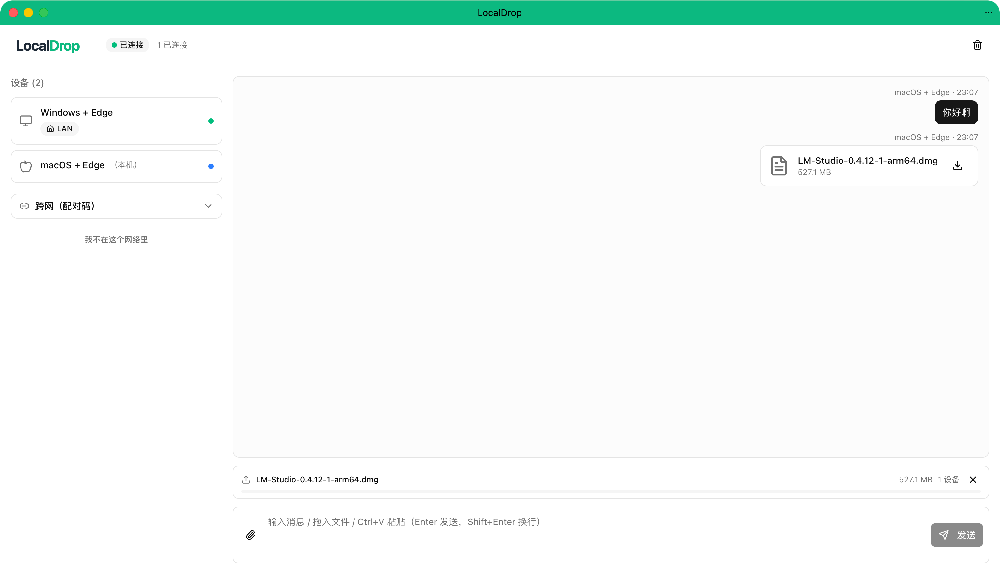
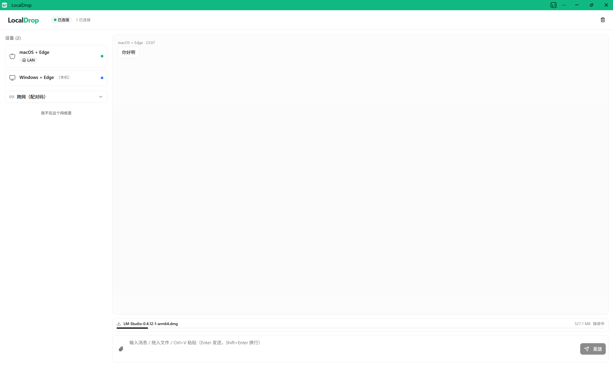

# LocalDrop

> Browser-based P2P file transfer between devices on the same network or across networks via pairing code. Inspired by SnapDrop / PairDrop / AirDrop.

打开网页，同 WiFi 设备秒互发；不同网络用 4 位配对码加入。文件走 WebRTC P2P，不经服务器。零安装、零账号、跨平台，**可装为 PWA**（桌面 / 主屏独立启动，离线也能开）。

🔗 **在线体验** → <https://local-drop.fluttercn.com/>　·　地址栏右侧点「安装」即可装为 PWA

| macOS | Windows |
|:---:|:---:|
|  |  |

[](LICENSE)


## Why

| 工具 | 痛点 |
|---|---|
| AirDrop | 不跨平台（仅苹果生态） |
| 微信文件传输助手 | 压缩画质、有大小限制、需账号 |
| SnapDrop / PairDrop | 没有"跨网"模式（仅同 LAN） |
| **LocalDrop** | 同 LAN 自动发现 + 跨网配对码 + 走 P2P 不经服务器 |

## Features

- 🏠 **同 WiFi 自动发现** — 打开页面即互相可见，无需任何操作
- 🌐 **跨网配对码** — 4 位数字码加入对方"个人房间"，跨网络互传
- 📁 **文件 / 图片 / 视频 / 音频** — 媒体直接渲染，其他文件卡片下载
- 🔒 **不经服务器** — 信令仅交换 SDP/ICE 几 KB；内容走 WebRTC DataChannel，DTLS 加密
- 💾 **本地历史** — IndexedDB 持久化，刷新不丢
- 🎯 **拖拽 / Ctrl+V / 文件按钮** — 三种发送方式
- 📲 **PWA 可安装** — 桌面 / 主屏一键启动，独立窗口
- 🔁 **断线重连** — 15 秒宽限期内 ws 重连恢复房间，ICE Restart 自动恢复 P2P
- 🛡️ **CGNAT 隐私 opt-in** — 共享公网 IP 下首次出现陌生设备时弹询问

## Stack

Nuxt 4 · Vue 3 · TypeScript · shadcn-vue · Tailwind v4 · Pinia · WebRTC · IndexedDB (dexie) · Nitro WebSocket (crossws) · vite-pwa

## Quickstart

**普通用户**：直接访问 <https://local-drop.fluttercn.com/>，把链接发给对方，两台设备同时打开即可。

**自己跑**：

```bash
pnpm install
pnpm dev          # → http://localhost:3010/
```

需要 Node 22+ / pnpm 10+。打开两个浏览器 tab，无需任何配置即互相可见。

## 部署

最小自托管：

```bash
pnpm build
PORT=3010 LD_TRUST_PROXY=true node .output/server/index.mjs
```

Nginx 反向代理（关键：WebSocket upgrade + `X-Forwarded-For` 透传）：

```nginx
location / {
  proxy_pass http://127.0.0.1:3010;
  proxy_http_version 1.1;
  proxy_set_header Upgrade $http_upgrade;
  proxy_set_header Connection "upgrade";
  proxy_set_header X-Forwarded-For $remote_addr;
  proxy_set_header Host $host;
  proxy_read_timeout 600s;
}
```

完整环境变量见 [`.env.example`](.env.example)。

### 跨网 TURN 中继（可选）

默认只配了 STUN，同网络可直连。跨网络（不同 WiFi / 4G / 强 NAT）需要 TURN 服务器中继，否则会提示「无法直连」。

**1. 安装 coturn（Ubuntu/Debian）**

```bash
sudo apt install coturn
sudo systemctl enable coturn
```

**2. 编辑 `/etc/turnserver.conf`**

```ini
fingerprint
lt-cred-mech
realm=localdrop
user=localdrop:你自己的密码

# 云服务器（公网 IP 经 NAT 映射）必须配置此项：
# 格式：external-ip=公网IP/内网IP
# 公网 IP 可用 curl -s ifconfig.me 查看，内网 IP 用 ip addr 查看
external-ip=YOUR_PUBLIC_IP/YOUR_PRIVATE_IP
```

**3. 防火墙放行**

```bash
sudo ufw allow 3478/tcp
sudo ufw allow 3478/udp
sudo ufw allow 49152:65535/udp
```

云服务器还需在**安全组入站规则**中放行同样的端口（TCP 3478、UDP 3478、UDP 49152-65535）。

**4. 启动**

```bash
sudo systemctl restart coturn
```

**5. LocalDrop `.env` 配置**

```bash
LD_TURN_URL=turn:YOUR_PUBLIC_IP:3478
LD_TURN_USERNAME=localdrop
LD_TURN_CREDENTIAL=你自己的密码
```

配置后需重启 LocalDrop 并确保环境变量生效。如果用 PM2，`pm2 reload` 不会重新加载 `.env`，需显式指定：

```bash
LD_TURN_URL=turn:YOUR_PUBLIC_IP:3478 LD_TURN_USERNAME=localdrop LD_TURN_CREDENTIAL=你自己的密码 pm2 restart local-drop --update-env
```

可通过 `curl http://localhost:3010/api/config` 确认返回的 `iceServers` 中包含 TURN 条目。

⚠️ **必须 HTTPS**（WebRTC + IndexedDB 要求安全上下文，localhost 除外）。
⚠️ **建议独立（子）域名部署**，不要部署到子路径（如 `example.com/local-drop/`）——nitropack 2.13 在非根 `app.baseURL` 下 WebSocket 路由解析会被静态资源中间件拦截，信令握手不会被处理（详见 nitro 在 `h3App.stack` 上的 resolver 行为）。子路径模式留待 nitro 修复后再支持。
⚠️ **信令为内存态，单实例部署**（v1 不支持多副本横向扩展）。

## 架构

```
浏览器 A ←─── WebSocket 信令 ───→ Nuxt 信令服务器 ←─── 信令 ───→ 浏览器 B
   │                                                                  │
   └──────────────── WebRTC P2P DataChannel（消息 / 文件） ─────────────┘
```

- 服务器仅交换 SDP/ICE，无任何用户内容经过
- 内容走 P2P，DTLS 加密
- LAN 判定：同公网出口 IP（家庭路由 / Mesh / 双频段都覆盖）
- 跨网：4 位数字码（10000 组合）加入"创建者的个人房间"

详细设计：

- [需求文档](docs/requirements.md)
- [设计文档](docs/design.md)（含信令协议、ADR、状态机、配置参数）

## 限制（v1）

- 不支持文件断点续传（v1.3）
- 跨网需要自建 TURN 服务器（不提供公共 TURN）
- 不做应用层 E2EE（v1.4，已有 DTLS）
- 不做账号 / 跨设备同步 / 离线消息
- 单条文本上限 ~60KB（超过用文件传）
- 信令服务器无持久化，重启即丢房间状态

后续路线见 [`docs/requirements.md` §9](docs/requirements.md)。

## License

[MIT](LICENSE) © 2026 twoer
