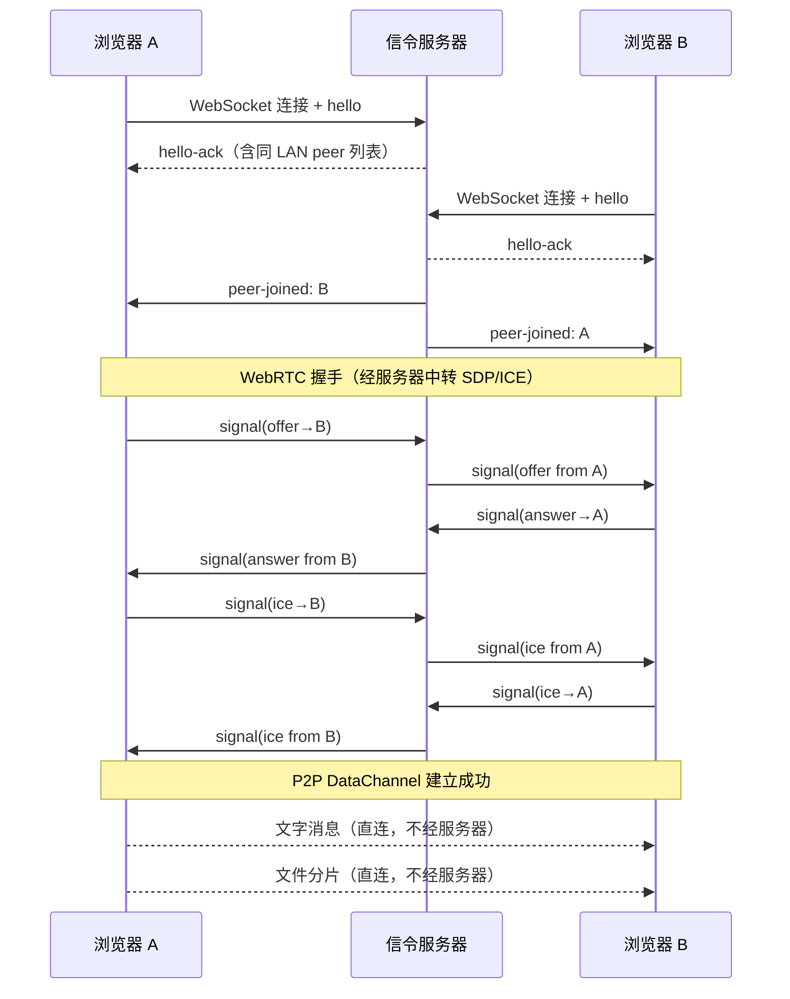
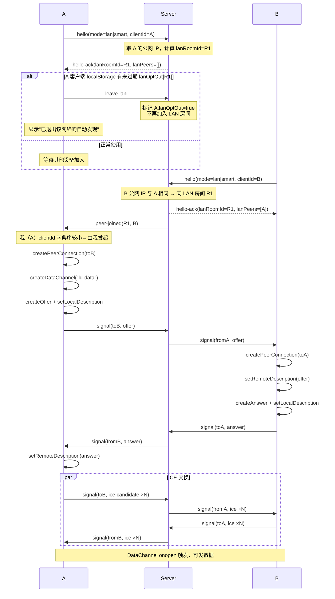
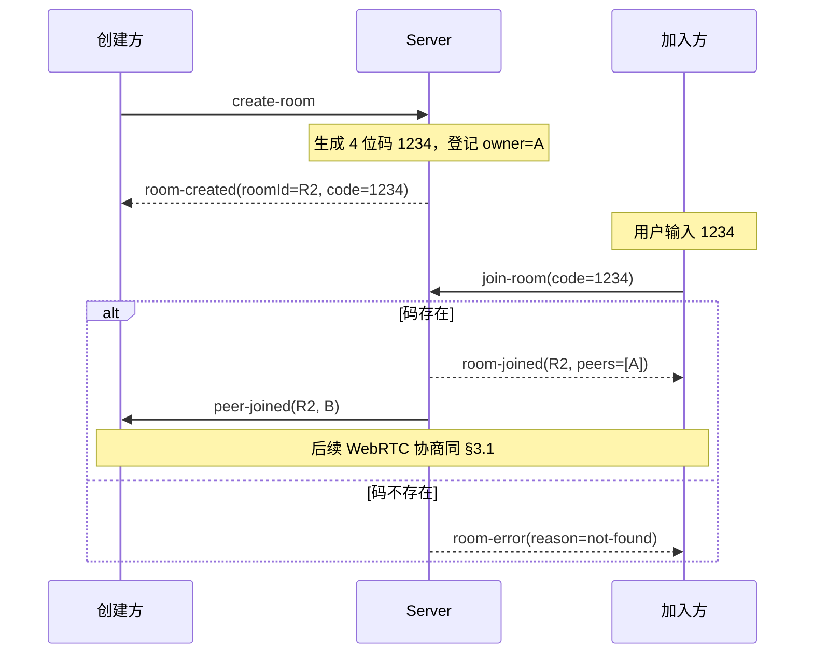
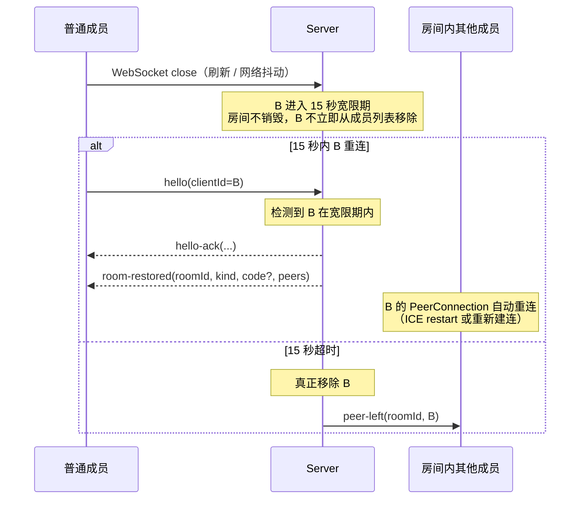
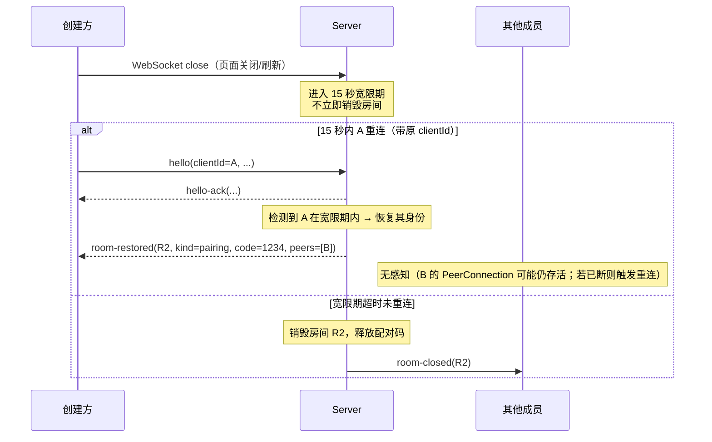
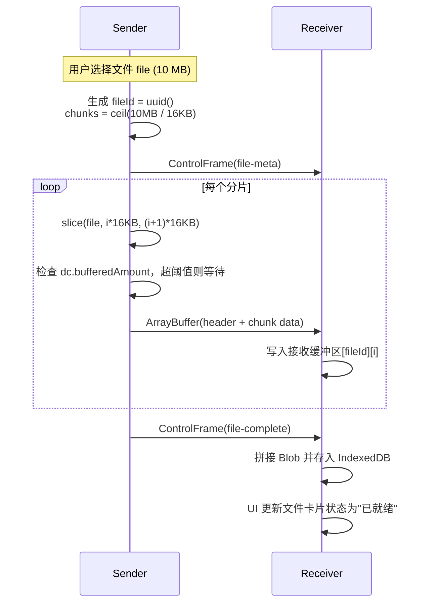
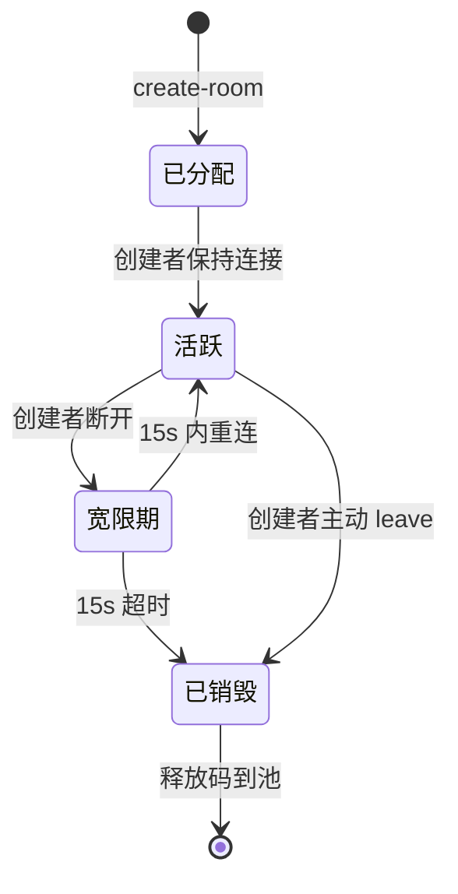
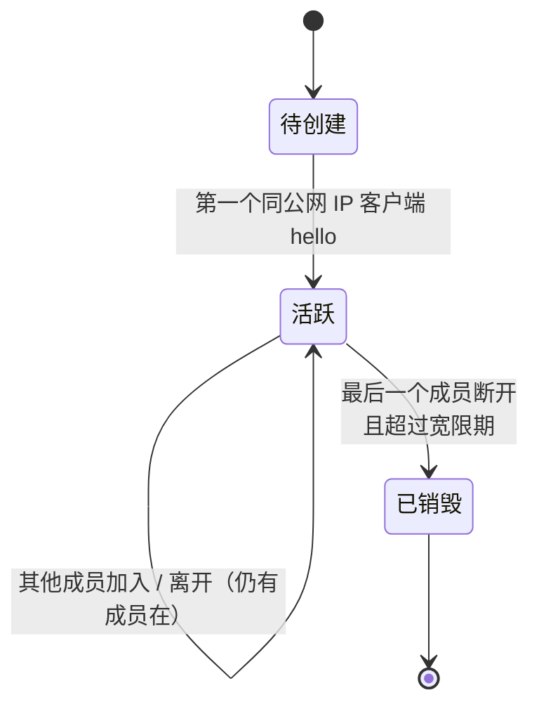
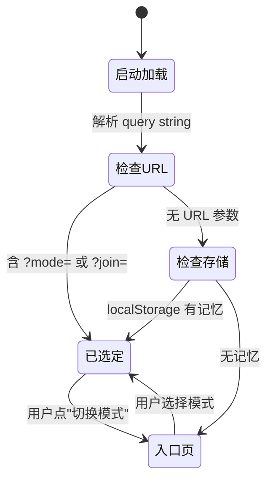
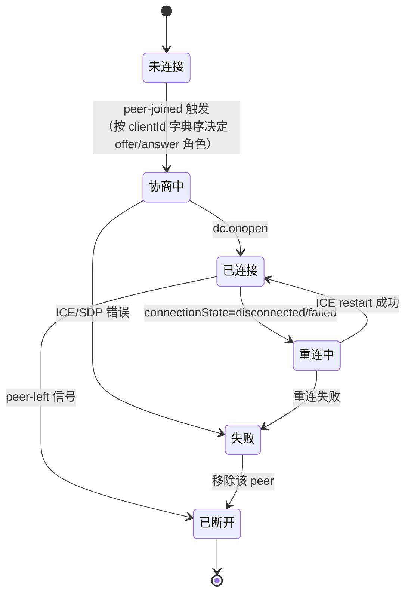

# LocalDrop 详细设计文档

> 版本：v1.3  
> 创建日期：2026-04-29  
> 最后更新：2026-04-29（三次审查：移除 already-joined / 拆 Client+Room / LanOptOutRecord 收敛 / 补 /api/config / 加测试策略 §14）  
> 对应需求文档：`requirements.md` v1.3  
> 状态：草案

## 0. 文档说明

本文档是 `requirements.md` 的实现层映射。需求层的"做什么"已在需求文档定稿，本文档关注"怎么做"：架构、协议、数据流、组件结构、状态机。

**阅读顺序建议**：§1 总览 → §2 信令协议 → §3 时序图 → §5 P2P 协议 → §7 前端结构。

---

## 1. 系统架构总览

### 1.1 顶层架构图

```mermaid
flowchart TB
  subgraph Browser_A[浏览器 A]
    UI_A[UI Layer<br/>Vue + shadcn-vue]
    State_A[Pinia Stores]
    Svc_A[Composables<br/>signaling / webrtc / idb]
    UI_A --> State_A
    State_A --> Svc_A
  end

  subgraph Server[Nuxt Nitro 服务器]
    WS[/api/ws<br/>WebSocket 信令]
    RoomStore[内存房间表]
    Matcher[LAN 公网 IP 匹配器]
    CodePool[配对码池<br/>0000-9999]
    WS --> RoomStore
    WS --> Matcher
    WS --> CodePool
  end

  subgraph Browser_B[浏览器 B]
    UI_B[UI Layer]
    State_B[Pinia Stores]
    Svc_B[Composables]
    UI_B --> State_B
    State_B --> Svc_B
  end

  Svc_A <-->|WebSocket<br/>信令握手| WS
  Svc_B <-->|WebSocket<br/>信令握手| WS
  Svc_A <===>|WebRTC P2P<br/>DataChannel<br/>消息+文件| Svc_B
```

### 1.2 关键约定

- **数据路径**：消息和文件**只走 WebRTC P2P**，从不经服务器
- **信令路径**：仅 SDP/ICE 几 KB 数据经服务器中转
- **服务端无状态持久化**：房间和配对码全部在内存，重启即丢
- **客户端持久化**：
  - **IndexedDB**：消息 + 文件 Blob
  - **localStorage**：模式偏好（`mode`）、`lanOptOut` 列表
  - **sessionStorage**：`clientId`（每 tab 独立，详见 ADR-008）

### 1.3 一次完整通信流程概览



---

## 2. 信令协议（WebSocket 消息格式）

### 2.1 共享类型定义

文件位置：`shared/types/signaling.ts`（前后端共用）

```typescript
// 客户端身份
export type ClientId = string; // UUID v4

// 设备信息
export type DeviceInfo = {
  clientId: ClientId;
  name: string;          // "macOS + Chrome"，含同型号去重序号
  os: 'macOS' | 'Windows' | 'iOS' | 'Android' | 'Linux' | 'Unknown';
  browser: 'Chrome' | 'Edge' | 'Safari' | 'Firefox' | 'Unknown';
};

// 房间类型
export type RoomKind = 'lan' | 'pairing';

// 用户模式
export type Mode = 'lan' | 'wan' | 'smart';

// WebRTC 信令载荷
export type SignalPayload =
  | { kind: 'offer';  sdp: string }
  | { kind: 'answer'; sdp: string }
  | { kind: 'ice';    candidate: RTCIceCandidateInit };
```

### 2.2 客户端 → 服务端

```typescript
export type ClientMessage =
  // 首次握手：声明身份和模式
  // 服务端从 socket 取公网 IP，无需客户端上报内网信息
  | {
      type: 'hello';
      clientId: ClientId;
      device: Omit<DeviceInfo, 'name'>; // name 由服务端补全（去重）
      mode: Mode;
    }
  // 主动退出 LAN 自动房间（"我不在这个网络里"）
  | { type: 'leave-lan' }
  // 创建配对码房间
  | { type: 'create-room' }
  // 加入配对码房间
  // 若该 client 已在另一个远程配对码房间中，服务端会先自动 leave 旧房间（向旧房间广播 peer-left），再加入新房间
  | { type: 'join-room'; code: string }
  // 主动离开配对码房间
  | { type: 'leave-room'; roomId: string }
  // 中转 WebRTC 信令到指定 peer
  | { type: 'signal'; toClientId: ClientId; payload: SignalPayload }
  // 心跳（兼容某些代理的空闲超时）
  | { type: 'ping' };

// 关于模式切换：不引入独立协议消息。
// 用户切换模式时，客户端关闭当前 WebSocket，重新建立连接并以新 mode 发 hello。
// 这样语义最清晰，且复用所有现有重连逻辑。
```

### 2.3 服务端 → 客户端

```typescript
export type ServerMessage =
  // hello 回执，附带当前已识别的 LAN 伙伴
  | {
      type: 'hello-ack';
      assignedName: string;        // 服务端去重后的最终设备名
      lanRoomId: string | null;    // 自动 LAN 房间 ID（null = 未匹配到）
      lanPeers: DeviceInfo[];      // 同 LAN 已在线的其他设备
    }
  // 创建配对码房间成功
  | { type: 'room-created'; roomId: string; code: string }
  // 加入配对码房间成功（含房间内现有成员）
  | { type: 'room-joined';  roomId: string; peers: DeviceInfo[] }
  // 宽限期内重连成功，恢复成员身份（与 room-joined 区分：客户端无需重发 join-room）
  | {
      type: 'room-restored';
      roomId: string;
      kind: 'lan' | 'pairing';
      code?: string;             // pairing 时回传，方便客户端 UI 重建
      peers: DeviceInfo[];
    }
  // 房间相关错误
  | {
      type: 'room-error';
      reason:
        | 'not-found'        // 加入码不存在
        | 'closed'           // 房间已销毁
        | 'pool-exhausted'   // 创建时码池满
        | 'invalid-code';    // 码格式不合法
    }
  // 有新 peer 加入（同 LAN 或同配对码房间）
  | { type: 'peer-joined'; roomId: string; peer: DeviceInfo }
  // 有 peer 离开
  | { type: 'peer-left';   roomId: string; clientId: ClientId }
  // 中转过来的 WebRTC 信令
  | { type: 'signal'; fromClientId: ClientId; payload: SignalPayload }
  // 房间被关闭（创建者退出）
  | { type: 'room-closed'; roomId: string }
  // 心跳响应
  | { type: 'pong' };
```

### 2.4 协议要点

- 所有消息都是 JSON，单个 WebSocket 帧
- `clientId` 由客户端生成（UUID v4），服务端不重新分配
- 同一 clientId 重连时，服务端按 `clientId` 在宽限期内恢复成员身份（详见 §6）
- 服务端**不为信令载荷做任何业务校验**，只是中转（路由按 `toClientId`）

---

## 3. WebRTC 协商时序

### 3.1 LAN 自动配对（双方进入即触发）



**发起方选择规则**：双方 `clientId` 字典序比较，**较小者发起 offer**。这是 P2P 中常用的"打破平局"策略，避免双方同时发 offer 导致协商错乱。

### 3.2 配对码加入



### 3.3 普通成员刷新 / 短暂掉线



> 与创建者的区别：普通成员超时移除**不会**导致房间销毁。

### 3.4 创建者关闭 vs 刷新



---

## 4. LAN 自动配对算法（服务端）

### 4.1 设计简化说明

> ⚠️ 本节设计**有意简化**，请先理解约束再看实现。

**约束**：现代浏览器（Chrome 2019+ / Safari / Firefox）默认对 WebRTC ICE host 候选地址做 **mDNS 屏蔽**——服务端拿到的不是 `192.168.1.5`，而是 `f47ac10b-...local`。除非请求 `getUserMedia` 权限解锁（UX 不可接受），否则**没有可靠方式让服务端获得真实内网 IP**。

**结论**：放弃内网网段比对，简化为**仅基于公网出口 IP** 判定 LAN。

### 4.2 输入

服务端在 WebSocket 连接建立时取得：
- `publicIp` = WebSocket 连接的 remote address
  - 直连场景：取 `socket.remoteAddress`
  - 反向代理后：取 `X-Forwarded-For` 第一个值（需在 Nuxt 中配置 trust proxy）

客户端**不需要**上报内网 IP，因此**不存在 `hello-ice` 消息类型**。

### 4.3 匹配逻辑

```typescript
// server/utils/lanMatcher.ts
type ClientNetwork = {
  clientId: string;
  publicIp: string;
};

export function isSameLan(a: ClientNetwork, b: ClientNetwork): boolean {
  return a.publicIp === b.publicIp;
}

// LAN 房间 ID = 公网 IP 的 hash（避免暴露 IP 给客户端）
export function lanRoomIdOf(publicIp: string): string {
  return sha256(`lan-room:${publicIp}`).slice(0, 12);
}
```

### 4.4 边缘情况与兜底

| 情况 | 处理 |
|------|-----|
| 反向代理未透传真实 IP | 服务端配置必须正确读取 `X-Forwarded-For`；否则所有用户公网 IP 相同 → 全员混在一起。**部署时必须验证** |
| 运营商级 NAT（CGNAT）下不同家庭被聚到同一 LAN 房间 | UI 提供"我不在这个网络里"按钮，客户端发送 `leave-lan` 消息退出该房间 |
| 同公网 IP 但跨 VPN / 公司内网 / VLAN | v1 接受误判，符合"广义同网络"语义。用户可手动退出 |
| IPv6 双栈环境（同一设备 v4 / v6 公网地址不同） | v1 按 socket 实际使用的协议族判定；同设备多次连接可能被分到不同 LAN 房间。极少见，v2 优化 |

### 4.5 客户端主动退出 LAN 房间

新增协议消息（已在 §2.2 定义为 `leave-lan`）。

```typescript
// 客户端：用户点击"我不在这个网络里"
ws.send({ type: 'leave-lan' });
// 客户端不等待显式响应；本地立即清空 LAN 设备列表 + 在 localStorage 记 lanOptOut

// 服务端处理 leave-lan：
// 1. 把该 client 从 LAN 房间移除
// 2. 向房间内其他成员广播 peer-left(roomId=lanRoom, clientId=自己)
// 3. 在 Member 上设 lanOptOut=true（本会话内不再加入 LAN 房间）
// 4. 不向发起方发回独立响应（操作幂等，客户端已乐观更新）
```

**幂等性**：重复发 `leave-lan` 应被服务端忽略（已 opt-out 的 client 再发不报错）。

**客户端 opt-out 持久化**：

```typescript
// localStorage 记录（按 fingerprint = lanRoomId 索引）
type LanOptOutRecord = {
  fingerprint: string;  // = lanRoomId（公网 IP 的 hash），从 hello-ack 拿到；不暴露原始公网 IP
  expiresAt: number;    // 默认 now + 7 days
};
```

下次客户端进入：
- 收到 `hello-ack(lanRoomId=R)` 后，先查 localStorage 是否存在 `fingerprint=R` 且未过期
- 若是 → 客户端立即发 `leave-lan` 退出
- 若否 → 正常使用 LAN 房间

---

## 5. P2P 数据通道协议（应用层）

### 5.1 通道配置

```typescript
const dc = pc.createDataChannel('ld-data', {
  ordered: true,             // 保证文件分片顺序
  maxRetransmits: undefined, // 允许重传（可靠通道）
});
```

> 文字和文件**共用一条 DataChannel**，按消息类型分发。

### 5.2 消息格式（控制帧 + 数据帧）

DataChannel 同时支持 string 和 binary：
- **控制帧**：JSON 字符串（meta、文字消息、完成通知）
- **数据帧**：ArrayBuffer（文件二进制分片）

```typescript
// shared/types/datachannel.ts

// 控制帧（string）
export type ControlFrame =
  | {
      type: 'text';
      id: string;             // 客户端生成的 messageId
      content: string;
      timestamp: number;
    }
  | {
      type: 'file-meta';
      id: string;             // fileId
      name: string;
      size: number;
      mime: string;
      chunks: number;         // 总分片数
      chunkSize: number;
      timestamp: number;
    }
  | {
      type: 'file-complete';
      id: string;
    }
  | {
      type: 'file-error';
      id: string;
      reason: string;
    };

// 数据帧（ArrayBuffer）格式：
// 头部 36 字节 = 32 字节 fileId（hex 字符串 ASCII）+ 4 字节 chunkIndex（uint32 BE）
// 余下为分片数据
// 接收端按头部字段路由到对应 fileId 的接收缓冲区
```

### 5.3 文件传输流程



### 5.4 分片大小与背压

- **分片大小**：16 KB（兼容所有主流浏览器，含 Safari）
- **缓冲水位**：
  - `bufferedAmountLowThreshold = 256 KB`
  - 当 `bufferedAmount > 1 MB` 时暂停发送，等待 `bufferedamountlow` 事件
- **进度计算**：发送方按已发送 chunkIndex / total，接收方按已收到 chunks 数

### 5.5 多 peer 群发（Mesh）

发送一条消息（文字或文件）时：

```typescript
async function broadcast(frame: ControlFrame, binary?: ArrayBuffer[]) {
  const promises = [...peers.values()].map(async (peer) => {
    peer.dc.send(JSON.stringify(frame));
    if (binary) {
      for (const chunk of binary) {
        await waitForBackpressure(peer.dc);
        peer.dc.send(chunk);
      }
    }
  });
  await Promise.all(promises);
}
```

> 每个 peer 独立背压；某 peer 慢不影响其他 peer。

### 5.6 多 peer 进度展示策略

文件传输到多个 peer 时，UI 单条文件卡片的展示规则：

```typescript
type FileTransferProgress = {
  fileId: string;
  perPeer: Map<ClientId, {
    sentBytes: number;
    totalBytes: number;
    state: 'pending' | 'sending' | 'done' | 'failed';
  }>;
};

// UI 聚合显示：
// 1. 主进度条 = min(每 peer 进度)，体现"全员收到"的进度
// 2. 副标题 = "X / N 已完成"（成功的 peer 数）
// 3. 点击展开 → 显示每个 peer 的子进度条 + 状态
// 4. 若有 peer 失败：主卡片显示"⚠ 部分失败"+ 重试按钮（仅重发到失败的 peer）
```

聚合规则确保用户不会被"某 peer 已 100% 但另一个还在 30%"误导。

### 5.7 MIME 类型识别与兜底

文件 MIME 类型用于决定接收端如何渲染（image/video/audio 直接渲染，其他显示卡片）。

某些场景下 `File.type` 为空字符串（系统未识别 / Linux 桌面拖入 / 移动端某些情况）。需要回退到扩展名判定：

```typescript
// shared/utils/mime.ts
const EXT_MIME_MAP: Record<string, string> = {
  // 图片
  jpg: 'image/jpeg', jpeg: 'image/jpeg', png: 'image/png',
  gif: 'image/gif', webp: 'image/webp', heic: 'image/heic',
  // 视频
  mp4: 'video/mp4', mov: 'video/quicktime', webm: 'video/webm',
  m4v: 'video/mp4', avi: 'video/x-msvideo',
  // 音频
  mp3: 'audio/mpeg', wav: 'audio/wav', m4a: 'audio/mp4',
  ogg: 'audio/ogg', flac: 'audio/flac',
  // 文档/压缩
  pdf: 'application/pdf', zip: 'application/zip',
  rar: 'application/vnd.rar', '7z': 'application/x-7z-compressed',
};

export function resolveMime(file: { name: string; type?: string }): string {
  if (file.type) return file.type;
  const ext = file.name.split('.').pop()?.toLowerCase();
  return (ext && EXT_MIME_MAP[ext]) || 'application/octet-stream';
}

export function isRenderable(mime: string): 'image' | 'video' | 'audio' | null {
  if (mime.startsWith('image/')) return 'image';
  if (mime.startsWith('video/')) return 'video';
  if (mime.startsWith('audio/')) return 'audio';
  return null;
}
```

发送方在生成 `file-meta` 时通过 `resolveMime` 取最终 MIME，接收方按此渲染。

### 5.8 失败处理

| 场景 | 行为 |
|------|------|
| 某 peer 的 DataChannel 关闭中途 | 该 peer 的传输标记失败；其他 peer 继续 |
| 用户切走/关闭页面 | 发送侧中断；接收侧收到 close → 标记"传输失败" |
| 接收端 chunks 不连续（中间缺失） | v1 不做选择性重传；整体失败提示重发 |

---

## 6. 房间与连接保持机制

### 6.1 客户端身份（clientId）

每个浏览器 **tab 独立** 一个 clientId，存放于 **`sessionStorage`**：

```typescript
function getOrCreateClientId(): string {
  const KEY = 'local-drop:clientId';
  let id = sessionStorage.getItem(KEY);
  if (!id) {
    id = crypto.randomUUID();
    sessionStorage.setItem(KEY, id);
  }
  return id;
}
```

**为什么用 sessionStorage 而不是 localStorage**：

| 行为 | sessionStorage | localStorage |
|------|---------------|---------------|
| 同 tab 刷新（F5） | ✅ 保留 | ✅ 保留 |
| 关闭 tab 后重开 | ❌ 重新生成（视为新设备，合理） | ✅ 复用（但是新 tab） |
| 同时开两个 tab | ✅ 各自独立 clientId | ❌ **冲突**：两 tab 同 ID 会导致服务端认作同一设备，断线重连机制错乱 |

> 选择 sessionStorage 解决多 tab 冲突；副作用是关闭再开会被识别为新设备，但这符合用户认知（每次打开新 tab 都是新会话）。

**设备名仍按 OS+浏览器 自动生成**，多 tab 场景下服务端去重追加 `(2)`、`(3)`，用户能在设备列表里区分。

### 6.2 服务端房间结构（内存）

> ⚠️ smart 模式下一个 client 可能同时在 LAN + 自创配对码 + 已加入的远程配对码三个房间内。
> 因此把"会话"和"成员"拆开：`Client` 与 ws 一对一（按 clientId 索引，宽限期内可恢复），
> `Room.members` 仅持有 clientId 引用。

```typescript
// 一个 WebSocket 会话 = 一个 Client（同 clientId 重连复用同一对象）
type Client = {
  clientId: ClientId;
  device: DeviceInfo;        // 含服务端去重后的 name
  ws: WebSocket | null;      // null = 断线状态
  disconnectedAt: number | null;
  publicIp: string;
  lanOptOut: boolean;        // 是否点过"我不在这个网络里"
  rooms: Set<RoomId>;        // 该 client 当前所在的所有房间（最多 3 个：LAN + 自创 + 加入）
};

type Room = {
  id: RoomId;
  kind: 'lan' | 'pairing';
  code?: string;             // 仅 pairing 房间有
  ownerClientId?: ClientId;  // 仅 pairing 房间有
  members: Set<ClientId>;    // 引用 Client，不再嵌套；查 Client 用顶层索引
  createdAt: number;
};

// 顶层 roomStore 索引：
//   clients:    Map<ClientId, Client>
//   rooms:      Map<RoomId, Room>
//   codeToRoom: Map<string, RoomId>
//
// 路由 signal：按 toClientId 在 clients 表查 ws 直接转发，无需遍历房间
// 广播事件（peer-joined / peer-left / room-closed）：先取 Room.members 的 clientId 列表，
// 再到 clients 表查每个 ws 发送
```

### 6.3 断线宽限期

```typescript
// 配置
const GRACE_PERIOD_MS = 15_000;
const ROOM_CLEANUP_MS = 5 * 60_000;

// WebSocket close 触发
function onClose(client: Client) {
  client.ws = null;
  client.disconnectedAt = Date.now();

  setTimeout(() => {
    if (client.disconnectedAt && Date.now() - client.disconnectedAt >= GRACE_PERIOD_MS) {
      // 仍未重连 → 从所有所在房间移除该 clientId，再清除 client 自身
      for (const roomId of client.rooms) {
        removeFromRoom(roomId, client.clientId); // 触发 peer-left 广播 + 房间空时销毁
      }
      clients.delete(client.clientId);
    }
  }, GRACE_PERIOD_MS + 100);
}

// hello 收到时（携带已知 clientId）
function onHello(ws, msg) {
  const existing = clients.get(msg.clientId);
  if (existing && existing.ws === null) {
    // 宽限期内重连：复用同一 Client 对象，rooms 集合自然保留
    existing.ws = ws;
    existing.disconnectedAt = null;
    return restoreMembership(existing); // 回 hello-ack + 对每个 rooms 成员发 room-restored
  }
  // 否则按新 client 处理
  return registerNewClient(ws, msg);
}
```

### 6.4 配对码房间生命周期



### 6.5 LAN 房间生命周期

LAN 房间无显式 owner，由公网 IP 动态决定。



**关键差异**：
- 无 owner 概念，任何成员的去留独立
- 房间销毁仅在"最后一个成员超过宽限期未重连"时触发
- 销毁后下一个同公网 IP 客户端进入会**重新创建**同 ID 的房间（lanRoomId 是公网 IP 的 hash，确定性）

---

## 7. 前端结构

### 7.1 目录结构（Nuxt 4）

```
local-drop/
├── app/                        # Nuxt 4 默认前端目录
│   ├── pages/
│   │   └── index.vue           # 唯一路由，按 query/store 切视图
│   ├── components/
│   │   ├── EntryPage.vue
│   │   ├── MainPage.vue
│   │   ├── room/
│   │   │   ├── LanRoomPanel.vue
│   │   │   ├── WanRoomPanel.vue
│   │   │   └── SmartRoomPanel.vue
│   │   ├── device/
│   │   │   ├── DeviceList.vue
│   │   │   └── DeviceItem.vue
│   │   ├── message/
│   │   │   ├── MessageStream.vue
│   │   │   ├── TextBubble.vue
│   │   │   ├── ImageBubble.vue
│   │   │   ├── VideoBubble.vue
│   │   │   ├── AudioBubble.vue
│   │   │   └── FileCard.vue
│   │   └── input/
│   │       ├── InputArea.vue
│   │       ├── FileButton.vue
│   │       └── DropZone.vue
│   ├── composables/
│   │   ├── useSignaling.ts     # WebSocket 客户端
│   │   ├── useWebRTC.ts        # PeerConnection 工厂
│   │   ├── usePeers.ts         # peer 状态总线
│   │   ├── useTransfer.ts      # 文件分片收发
│   │   ├── useIndexedDB.ts     # dexie 封装
│   │   └── useDeviceInfo.ts    # OS/浏览器解析
│   ├── stores/
│   │   ├── identity.ts
│   │   ├── mode.ts
│   │   ├── signaling.ts
│   │   ├── room.ts
│   │   ├── peers.ts
│   │   ├── messages.ts
│   │   └── transfer.ts
│   └── app.vue
├── server/
│   ├── routes/
│   │   └── api/
│   │       ├── ws.ts           # crossws 信令端点
│   │       └── config.ts       # 客户端启动期拉 STUN/TURN URL（见 §13.3）
│   └── utils/
│       ├── roomStore.ts        # 内存房间表
│       ├── lanMatcher.ts       # LAN 网段判定
│       ├── codePool.ts         # 配对码分配
│       └── logger.ts
├── shared/
│   └── types/
│       ├── signaling.ts        # ClientMessage / ServerMessage
│       ├── datachannel.ts      # ControlFrame / 数据帧头格式
│       └── domain.ts           # DeviceInfo / Mode 等
└── docs/
    ├── requirements.md
    └── design.md
```

### 7.2 组件树

```
App
└── pages/index.vue
    ├── EntryPage          // shouldShowEntry === true
    │   ├── ModeCard ×3
    │   └── RememberCheckbox
    └── MainPage           // shouldShowEntry === false
        ├── TopBar
        │   ├── ModeIndicator
        │   ├── ConnectionStatus
        │   └── SwitchModeButton
        ├── RoomPanel       // 按 mode 切换
        │   ├── LanRoomPanel
        │   ├── WanRoomPanel
        │   │   ├── CreateRoomForm
        │   │   └── JoinRoomForm
        │   └── SmartRoomPanel
        ├── DeviceList
        │   └── DeviceItem ×N
        ├── MessageStream
        │   └── MessageBubble ×N
        │       ├── TextBubble
        │       ├── ImageBubble
        │       ├── VideoBubble
        │       ├── AudioBubble
        │       └── FileCard
        └── InputArea
            ├── TextInput
            ├── FileButton
            └── DropZone
```

### 7.3 Pinia Store 职责

| Store | 职责 | 持久化 |
|-------|-----|--------|
| `identity` | clientId（**sessionStorage**）、本机 DeviceInfo | sessionStorage |
| `mode` | 当前模式 / 是否记忆 | localStorage |
| `lanOptOut` | "我不在这个网络里"标记（按 publicIp 索引，7 天有效） | localStorage |
| `signaling` | WebSocket 连接状态、重连计数 | 否 |
| `room` | 当前房间（LAN + 个人配对码 + 已加入的远程房间） | 否 |
| `peers` | `Map<clientId, PeerEntry>`：含 PC、DC、连接状态 | 否 |
| `messages` | 消息时间线（内存索引）、与 IDB 同步 | IndexedDB |
| `transfer` | 进行中的文件传输（进度、per-peer 状态） | 否（进程内） |

```typescript
// stores/peers.ts 的核心结构
type PeerEntry = {
  device: DeviceInfo;
  pc: RTCPeerConnection;
  dc: RTCDataChannel | null;
  state: 'connecting' | 'connected' | 'reconnecting' | 'failed' | 'disconnected';
  roomContext: 'lan' | 'my-pairing' | 'joined-pairing';
};
```

### 7.4 Composables 职责

- **useSignaling**：开 WebSocket、收发 ClientMessage/ServerMessage、自动重连（指数退避）
- **useWebRTC**：根据 peer-joined 事件创建 PC、协商 SDP/ICE、创建 DataChannel
- **usePeers**：维护 peer Map，监听 dc.onmessage 路由到 transfer / message store
- **useTransfer**：把 File 切片、发送、组装、写 IndexedDB
- **useIndexedDB**：dexie 封装，导出 `messages` / `files` 表 API

---

## 8. IndexedDB Schema

使用 [`dexie`](https://dexie.org)。

### 8.1 表结构

```typescript
// composables/useIndexedDB.ts
import Dexie, { type Table } from 'dexie';

export type MessageRecord = {
  id: string;                  // 客户端生成 UUID
  // 上下文：拍平为两个字段，便于 IDB 索引
  contextKind: 'lan' | 'my-pairing' | 'joined-pairing';
  contextCode?: string;        // joined-pairing 时的房间码
  direction: 'sent' | 'received';
  senderClientId: string;
  senderName: string;
  kind: 'text' | 'file';
  timestamp: number;
  // text:
  text?: string;
  // file:
  fileId?: string;             // 指向 files 表
  fileName?: string;
  fileSize?: number;
  fileMime?: string;
};

// 注意：MessageRecord 中不存"消息状态"。
// IDB 中只持久化"已完成"的消息：
//   - sent：本地已完整发出（最后一片已离开本地 buffer）
//   - received：完整接收并已落 IDB
// 进行中 / 失败的传输由 transfer store（内存）管理，重启后丢失（v1 接受）。
// 这样既符合需求"v1 不做消息状态语义"，又简化数据模型。
//
// 关于 contextKind / contextCode：
// 仅作为"消息发生在哪个房间上下文"的展示分组标签，不是访问控制边界。
// 历史记录的真相源是本机 IDB（与需求 §4.3 一致）：用户切换/退出房间后，
// 历史依然完整可见，UI 可按上下文筛选或合并展示。

export type FileRecord = {
  id: string;                  // = MessageRecord.fileId
  blob: Blob;
  name: string;
  mime: string;
  size: number;
  storedAt: number;
};

class LocalDropDB extends Dexie {
  messages!: Table<MessageRecord, string>;
  files!: Table<FileRecord, string>;

  constructor() {
    super('local-drop');
    this.version(1).stores({
      messages: 'id, [contextKind+contextCode], timestamp',
      files: 'id',
    });
  }
}

export const db = new LocalDropDB();
```

### 8.2 索引说明

- `messages.[contextKind+contextCode]`：复合索引，按上下文分组查询（lan / my-pairing / joined-pairing+code）
- `messages.timestamp`：时间排序
- `messages.id` 主键：插入/删除单条消息
- `files.id` 主键：消息引用即可定位文件 Blob

### 8.3 容量约束（v1）

- 不主动管理容量，依赖浏览器配额（一般是磁盘 60%）
- 超出时 IDB 抛错 → Toast 提示（见 §5.5.4）
- v2 加配额监测和清理面板

---

## 9. 状态机

### 9.1 模式选择



### 9.2 单 Peer 连接状态



#### 9.2.1 与 RTCPeerConnection 真实 API 状态的映射

WebRTC API 同时暴露多个底层状态字段。我们的简化状态机用以下规则**派生**：

```typescript
// 派生函数：从 RTCPeerConnection + RTCDataChannel 推出我们的 5 态
function derivePeerState(pc: RTCPeerConnection, dc: RTCDataChannel | null): PeerState {
  if (pc.connectionState === 'closed') return 'disconnected';
  if (pc.connectionState === 'failed') return 'failed';

  if (dc?.readyState === 'open' && pc.connectionState === 'connected') {
    return 'connected';
  }

  if (pc.connectionState === 'disconnected') {
    // 浏览器自动判定 ICE 短暂失联；进入重连
    return 'reconnecting';
  }

  if (pc.connectionState === 'new') return 'disconnected';
  // 其余 'connecting' / dc 还没 open → 协商中
  return 'connecting';
}
```

#### 9.2.2 监听的事件

| 我们的状态变化 | 监听的浏览器事件 |
|---------------|-----------------|
| 未连接 → 协商中 | 信令收到 `peer-joined` → 主动调用 `createOffer` 或等待 `offer` |
| 协商中 → 已连接 | `dc.onopen` |
| 协商中 → 失败 | `pc.onicecandidateerror`（致命错误）/ 协商超时（自定义 30s） |
| 已连接 → 重连中 | `pc.onconnectionstatechange` 触发且 `pc.connectionState === 'disconnected'` |
| 重连中 → 已连接 | `pc.onconnectionstatechange` 回到 `'connected'`（浏览器自动恢复或我们手动 `pc.restartIce()` 后） |
| 重连中 → 失败 | 重连超时（自定义 10s）或 `connectionState === 'failed'` |
| 已连接/失败 → 已断开 | 信令 `peer-left` / 主动 `pc.close()` |

#### 9.2.3 ICE Restart 触发条件

- 进入"重连中"状态后等待 **3 秒**（让浏览器自己恢复短暂抖动）
- 仍未恢复 → 主动 `pc.restartIce()`，重新协商 ICE 候选
- 仅由 **clientId 字典序较小者** 触发 restart（避免双方同时发新 offer），与初始协商发起规则一致

#### 9.2.4 多个底层状态字段说明（开发参考）

WebRTC API 暴露的 4 个相关状态：

| API 字段 | 说明 | 我们是否直接用 |
|---------|------|--------------|
| `pc.signalingState` | SDP 协商阶段（`stable` / `have-local-offer` / ...） | ❌ 仅在调试时打日志 |
| `pc.iceGatheringState` | ICE 候选收集进度 | ❌ |
| `pc.iceConnectionState` | ICE 连通性（旧 API，含 `disconnected` / `failed`） | ⚠️ 旧浏览器兜底 |
| `pc.connectionState` | 整体连接状态（聚合 ICE + DTLS） | ✅ **首选** |
| `dc.readyState` | DataChannel 状态 | ✅ 与 `pc.connectionState` 联合判断"已连接" |

> Safari 较老版本 (≤ 14) 的 `pc.connectionState` 支持不完整。使用 `bowser` 检测后做兼容：缺失时回退用 `iceConnectionState`。

### 9.3 文件传输（发送端）

```mermaid
stateDiagram-v2
  [*] --> 待发送
  待发送 --> 发 file-meta: 用户选择文件
  发 file-meta --> 发分片: meta 已发出
  发分片 --> 发分片: 还有未发分片<br/>检查背压
  发分片 --> 发 complete: 全部分片已发
  发 complete --> 完成
  
  发分片 --> 失败: dc closed / 异常
  发 file-meta --> 失败: dc closed
  失败 --> [*]
  完成 --> [*]
```

---

## 10. 关键技术决策记录（ADR-style）

### ADR-001：信令使用 WebSocket，不用 SSE 或长轮询

- 信令是双向通信，WebSocket 最自然
- Nuxt Nitro 通过 `crossws` 原生支持
- 心跳机制简单（自定义 ping/pong）

### ADR-002：分片大小 16 KB

- 兼容 Safari（其默认上限较保守）
- 文件 ≤ 10MB 场景下分片数可控（≤ 640）
- 大文件场景延后到 v1.3 优化

### ADR-003：clientId 由客户端生成，不由服务端分配

- 服务端无状态持久化，客户端是真相源
- 跨刷新 / 跨重连保持身份的成本最低

### ADR-004：文字和文件共用一条 DataChannel

- 简化连接管理（一个 peer 一个 DC）
- 消息按 `type` 字段分发，开销可忽略
- v2 大文件场景如有需要再开独立通道

### ADR-005：发起方按 clientId 字典序决定

- 解决"同时发 offer"导致的 SDP 冲突
- 完全确定性，不需要协调
- 业内常见做法

### ADR-006：LAN 房间 ID 用 hash，不用裸公网 IP

- 同时不暴露公网 IP 给客户端
- 不解决 CGNAT 误判问题（误判由"我不在这个网络里"按钮兜底）

### ADR-007：放弃内网网段比对，仅用公网 IP 判定 LAN

- **背景**：现代浏览器 mDNS 屏蔽了 ICE host 候选的真实内网 IP
- **替代方案权衡**：
  - 请求 `getUserMedia` 解锁真实 IP → UX 灾难，pass
  - 优化版"乐观分组 + WebRTC 验证" → v1 投入产出比低
- **决策**：v1 仅以公网 IP 判定，CGNAT 误判由 UI 退出按钮兜底
- **影响**：原本担心的"双频段不同 /24 被分隔"反而成了优势——全部归同一 LAN

### ADR-008：clientId 用 sessionStorage 而非 localStorage

- localStorage 在多 tab 场景下产生 ID 冲突，破坏断线重连机制
- sessionStorage 同 tab 刷新保留、新 tab 独立、关闭即失效——符合"每个 tab 是独立设备"的语义
- 副作用：关闭再开会被识别为新设备（接受）

### ADR-009：模式切换通过重连而非协议消息

- 切换模式 = 关闭 WebSocket → 用新 mode 重发 hello
- 复用所有现有重连逻辑，无需新增协议状态
- 副作用：切换瞬间所有 P2P 连接断开（接受，因为不同模式房间语义不同）

### ADR-010：消息记录不存"状态"，进行中状态由内存 store 管

- 符合需求 "v1 不做消息状态语义"
- 简化 IDB 数据模型
- 重启后丢失"进行中"传输（v1 接受，v2 加恢复机制）

---

## 11. 开发顺序建议

按"由内到外、由协议到 UI"的顺序，每一步都能独立验证：

1. **shared 类型定义** — 信令协议 + 数据通道协议
2. **服务端骨架** — Nitro WebSocket + 内存房间表 + LAN 匹配
3. **客户端 Composables 层** — useSignaling / useWebRTC / useTransfer
4. **Pinia stores** — 状态聚合
5. **最小可用 UI** — 一个页面，展示设备列表 + 输入框，能互发文字
6. **文件传输** — meta + chunks + IDB 存储
7. **媒体渲染** — 图片/视频/音频/文件卡片
8. **入口模式 + URL 参数**
9. **错误处理与边缘情况**
10. **验收清单逐条过**

---

## 12. 待办与未决

| 项 | 决策时机 |
|---|---------|
| 选 `marked` 还是 `markdown-it` | v1.6（目前不做） |
| 浏览器 UA 解析库选 `bowser` 还是自己写 | 开发阶段，倾向 `bowser`（小巧） |
| dexie 还是 idb-keyval | dexie（结构化查询更友好） |
| crossws 还是 raw ws | crossws（Nuxt Nitro 原生集成） |
| `bowser` 解析失败时的兜底 | 显示为 `Unknown + Unknown`，不阻塞 |

---

## 13. 配置参数集中表

所有可调参数集中在此，命名以 `LD_*` 前缀的环境变量覆盖默认值。

### 13.1 服务端

| 参数 | 默认值 | 环境变量 | 说明 |
|------|------|---------|------|
| 信令端口 | `3000` | `PORT` | Nuxt 默认端口 |
| 是否信任反代 | `true` | `LD_TRUST_PROXY` | true 时按 `X-Forwarded-For` 取公网 IP，**部署前必须验证** |
| 断线宽限期（毫秒） | `15_000` | `LD_GRACE_PERIOD_MS` | 同 §6.3 |
| 房间清理延迟（毫秒） | `300_000` | `LD_ROOM_CLEANUP_MS` | 房间销毁后清理资源的延迟 |
| 配对码池容量 | `10000`（固定） | — | 4 位纯数字上限 |
| WebSocket 心跳间隔（毫秒） | `30_000` | `LD_WS_HEARTBEAT_MS` | 服务端发 ping，超时则断 |
| WebSocket 心跳超时（毫秒） | `60_000` | `LD_WS_HEARTBEAT_TIMEOUT_MS` | 客户端 pong 超时阈值 |

### 13.2 客户端

| 参数 | 默认值 | 来源 | 说明 |
|------|------|---------|------|
| 重连指数退避序列 | `[1s, 2s, 4s, 8s, 16s]` | 编译期常量 | WebSocket 首连失败 |
| 重连最大尝试次数 | `5` | 编译期常量 | 超出后 Toast 提示 |
| WebRTC 协商超时（毫秒） | `30_000` | 编译期常量 | 协商中状态最大停留时间 |
| ICE Restart 等待（毫秒） | `3_000` | 编译期常量 | 重连中状态先等浏览器自愈 |
| ICE Restart 超时（毫秒） | `10_000` | 编译期常量 | restart 后仍连不上则失败 |
| 文件分片大小 | `16 KB` | 编译期常量 | 见 ADR-002 |
| DataChannel `bufferedAmountLowThreshold` | `256 KB` | 编译期常量 | 背压恢复阈值 |
| DataChannel 暂停发送阈值 | `1 MB` | 编译期常量 | 超过则等待 `bufferedamountlow` |
| 文件大小提示阈值 | `50 MB` | 编译期常量 | 超过提示"较大文件可能耗时" |
| `lanOptOut` 默认有效期 | `7 天` | 编译期常量 | 见 §4.5 |

### 13.3 STUN / TURN

| 参数 | 默认值 | 配置方式 |
|------|------|---------|
| STUN 主 | `stun:stun.l.google.com:19302` | `LD_STUN_PRIMARY` |
| STUN 备（国内） | `stun:stun.qq.com:3478` | `LD_STUN_BACKUP` |
| TURN | （v1 不启用） | `LD_TURN_URL` / `LD_TURN_USERNAME` / `LD_TURN_CREDENTIAL`（v1.2 加） |

> 客户端通过 `/api/config` 端点拉取 STUN URL 列表，避免硬编码到前端 bundle。

### 13.4 部署注意事项

- **反向代理透传**：必须确保 `X-Forwarded-For` 真实可信，否则 LAN 判定全错
- **WebSocket 路径**：`/api/ws`，需要在反代层启用 WebSocket 升级
- **IPv6 双栈**：建议反代层 normalize IPv4，或服务只 listen IPv4，避免同设备双 IP 互看不到
- **HTTPS 证书**：必须有效；WebRTC 在非 HTTPS 下不工作（localhost 除外）

---

## 14. 测试策略

### 14.1 测试金字塔

| 层 | 工具 | 范围 | 重点 |
|---|------|------|------|
| 单元 | Vitest | `shared/utils/*`、`server/utils/*`、纯函数 composables | 协议解析、LAN 匹配、码池、MIME 兜底 |
| 集成 | Vitest + WebSocket mock | 信令协议会话级流程（不开浏览器） | hello → room-joined → peer-joined → signal 路由 |
| E2E | Playwright（同 origin 多 BrowserContext） | 同 LAN 多设备模拟 | 设备发现、互发文字/文件、刷新重连 |

### 14.2 必测场景

**单元层**
- `lanMatcher.isSameLan` / `lanRoomIdOf` 决定性 + 边界（IPv6 / 空字符串）
- `codePool` 分配 / 释放 / 池满 / 同码重入
- `resolveMime` 已知扩展名 / 未知扩展名 / `File.type` 为空
- `derivePeerState` 各 RTCPeerConnection 状态组合（§9.2.1）
- 控制帧 / 数据帧 头部 36 字节解析的可逆性

**集成层**
- `create-room` → `close ws` → 15s 内重连 → 收到 `room-restored`
- `create-room` → `close ws` → 超时 → 其他成员收到 `room-closed`，码回收到池
- `join-room` 时该 client 已在另一远程房间 → 旧房间广播 `peer-left` + 新房间 `room-joined`（验证决议 #1）
- smart 模式：单 ws 同时持有 LAN + 自创 + 加入三个 roomId，`signal` 按 `toClientId` 直接路由（验证决议 #2）
- `leave-lan` 幂等（重复发不报错；已 opt-out 的 client 不再被加入 LAN 房间）
- `signal` 转发不会泄漏到非目标 peer

**E2E 层**
- 同 origin 多 tab 模拟同 LAN，互发文字 / 图片 / 10MB zip
- 刷新发起方 tab，5s 内房间和消息流恢复，IDB 历史完整
- "我不在这个网络里" → 该 tab 设备列表立即清空，其他 tab 收到 peer-left
- 模拟弱网（Playwright 路由延迟 / 限速）：背压不卡死 UI，进度条单调推进

### 14.3 不在 v1 范围

- 真实多机跨设备 E2E（依赖手测清单 §10）
- 大文件（> 50 MB）压力 / 长时间稳定性
- 浏览器矩阵自动化（手测覆盖 Mac/Win/iOS/Android 即可）
- 真实 CGNAT / 跨区 NAT 打洞场景（v1 不保证）
